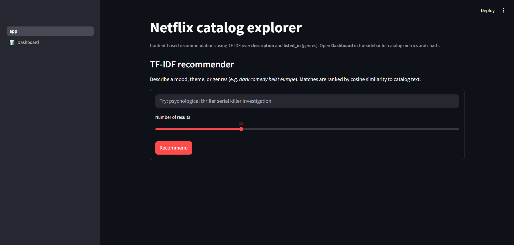
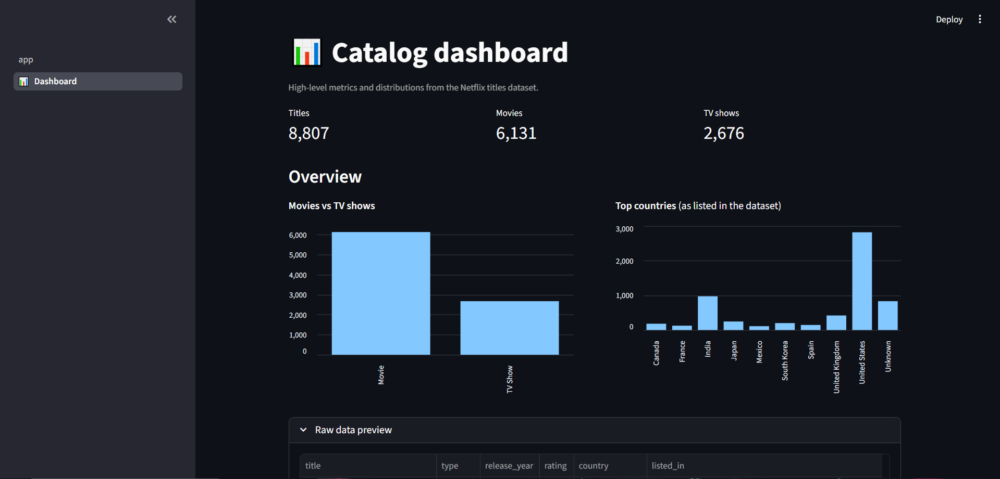

# 🎬 Netflix Catalog Explorer & NLP Recommender

An interactive, content-based recommendation engine that helps users discover Netflix movies and TV shows using Natural Language Processing. Built with Python and Streamlit, featuring real-time data enrichment via the TMDB API.

## 🖥️ Application Previews

### The Recommender Engine
*Features live TMDB API integration for real-time posters and similarity scoring.*
 

### The Global Catalog Dashboard
*Visualizes dataset metrics, content distributions, and regional production trends.*


---

## 🚀 Enterprise Features

* **Semantic Search Engine:** Uses NLP (TF-IDF Vectorization and Cosine Similarity) to match complex user queries (e.g., "dark psychological thriller") with catalog descriptions, genres, and tags.
* **Live TMDB API Integration:** Dynamically fetches high-resolution movie posters and official community ratings in real-time to enrich the static dataset.
* **Modular Architecture:** Clean separation of concerns with a dedicated Machine Learning engine (`ml_engine.py`) handling the matrix calculations separately from the UI.
* **Interactive UI:** Built with Streamlit, featuring responsive grid layouts, dynamic similarity scoring badges, and custom fallback placeholders.
* **Data Export:** Users can instantly download their personalized AI recommendation lists as CSV files for offline viewing.

## 🛠️ Tech Stack

* **Language:** Python
* **Frontend Dashboard:** Streamlit
* **Machine Learning & NLP:** Scikit-Learn (`TfidfVectorizer`, `cosine_similarity`), Pandas, NumPy
* **External Integrations:** TMDB (The Movie Database) REST API

## 🧠 Under the Hood (The ML Engine)

The system moves beyond simple keyword matching by converting the Netflix catalog into a dense mathematical matrix. 

1. **Text Preprocessing:** Combines movie summaries, genres, and tags into a unified text corpus.
2. **Vectorization:** Applies Sublinear TF-IDF (Term Frequency-Inverse Document Frequency) with n-gram ranges to weigh the semantic importance of words.
3. **Similarity Scoring:** When a user searches, their query is vectorized and compared against the 12,000+ item matrix using Cosine Similarity to return the most mathematically relevant matches.

## 💻 Installation & Usage

1. Clone the repository:

```bash
git clone https://github.com/Sanidhya069/Netflix-Catalog-Explorer-NLP-Recommender.git
cd Netflix-Catalog-Explorer-NLP-Recommender
```

2. Install dependencies:

```bash
pip install -r requirements.txt
```

3. Set up your API Key:  
Create a `.env` file or export the variable in your terminal:

```bash
export TMDB_API_KEY="your_api_key_here"
```

4. Run the application:

```bash
streamlit run app.py
```

---

## 👨‍💻 Author

Sanidhya Shrivastava | [LinkedIn](https://www.linkedin.com/in/sanidhya10/) | [GitHub](https://github.com/Sanidhya069)